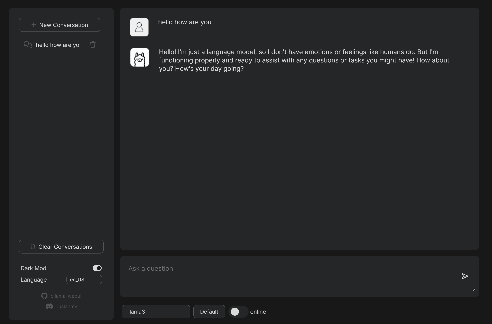

# Ollama WebUI

The **Ollama WebUI** provides a simple interface for running a local LLM (Large Language Model). This is a great solution for users who need an LLM without internet access.



## Table of Contents
- [Features](#features)
- [Getting Started](#getting-started)
  - [Cloning the Repository](#cloning-the-repository)
  - [Installing Dependencies](#installing-dependencies)
- [Running the Application](#running-the-application)
- [Docker Setup](#docker-setup)
  - [Prerequisites](#prerequisites)
  - [Running with Docker](#running-with-docker)
- [Credits](#credits)
- [Legal Notice](#legal-notice)

## Features
- Fully local LLM operation
- Easy setup and deployment using Docker or Python
- Web-based user interface for interaction with the LLM

## Getting Started

### Cloning the Repository
To begin, clone the repository:
```bash
git clone https://github.com/ruslanmv/ollama-webui.git
```

### Installing Dependencies
Navigate to the project directory:
```bash
cd ollama-webui
```

Install the required dependencies:
```bash
pip install -r requirements.txt
```

Download [Ollama](https://ollama.com/download) and ensure [Python](https://www.python.org/downloads/) is installed on your system.

## Running the Application
To start the application, use the following command:
```bash
python run.py
```

Access the WebUI in your browser at:
- `http://127.0.0.1:1338`
- `http://localhost:1338`

## Docker Setup

### Prerequisites
Make sure [Docker](https://www.docker.com/get-started) is installed on your system.

### Running with Docker
Pull the Docker image:
```bash
docker pull ruslanmv/ollama-webui
```

Run the application using Docker:
```bash
docker run -p 1338:1338 ruslanmv/ollama-webui
```

Access the WebUI in your browser at:
- `http://127.0.0.1:1338`
- `http://localhost:1338`

To stop the Docker container, use:
```bash
docker stop <container-id>
```

## Credits
This project is based on the **FreeGPT-WebUI** and has been modified to implement the Ollama setup. We extend our gratitude to the original creators for their work.

## Legal Notice
This repository is provided for **educational purposes only** and is not associated with or endorsed by any of the providers of the APIs or services referenced within. Use of this repository and its contents is at your own risk.

### Key Points
1. **Ownership**: Trademarks and APIs mentioned belong to their respective owners.
2. **Disclaimer**: The author is not responsible for any misuse of this repository.
3. **Educational Use**: This project is intended solely for learning purposes.
4. **Compliance**: Users must adhere to the terms of service of any APIs or models used.
5. **License**: Content in this repository is protected under the GNU GPL license.

By using this repository, you agree to these terms.

